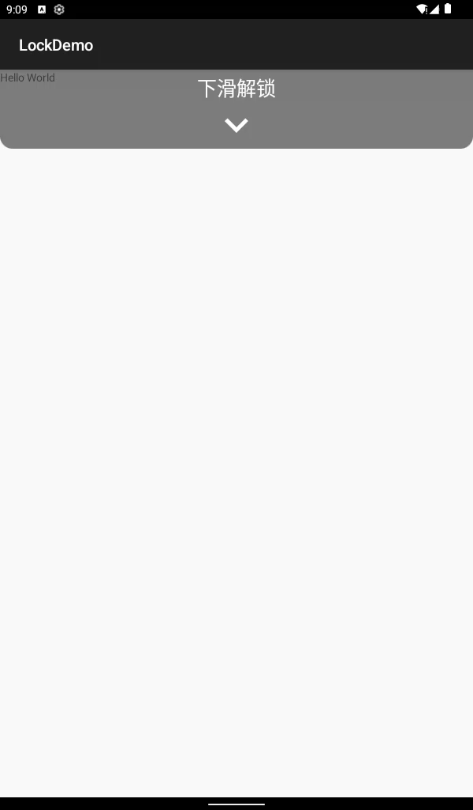

##DeepWiki: https://deepwiki.com/zoorabbit/LockDemo
## 1. 需求描述

项目使用定制 **Android** 系统，需求是顶部窗帘能上下拉完成解锁锁屏，开始考虑滑动效果 准备使用 **DrawerLayout** 或者 **BottomSheetDialog** 来实现，最后发现还是 自定义 **View** 来实现最简单。



## 2. 实现步骤和代码示例

### 2.1 布局设计

```xml
<?xml version="1.0" encoding="utf-8"?>
<FrameLayout xmlns:android="http://schemas.android.com/apk/res/android"
    xmlns:tools="http://schemas.android.com/tools"
    android:layout_width="match_parent"
    android:layout_height="match_parent"
    android:gravity="center"
    android:orientation="vertical"
    tools:context=".MainActivity">

    <TextView
        android:layout_width="wrap_content"
        android:layout_height="wrap_content"
        android:text="Hello World"
        tools:ignore="HardcodedText" />

    <androidx.fragment.app.FragmentContainerView
        android:id="@+id/fcv_lock"
        android:layout_width="match_parent"
        android:layout_height="match_parent" />
</FrameLayout>
```
**FrameLayout** 作为根布局，用于叠加各个层级的视图。  
**FragmentContainerView** 用于加载 自定义锁屏界面 **LockScreenFragment** 

### 2.2 自定义锁屏界面 LockScreenFragment

```kotlin
/**
 * 锁屏 Fragment
 * Created by RoyYao on 2025/2/27
 */
class LockScreenFragment :
    Fragment() {
    private lateinit var binding: FragmentLockBinding
    private var offsetY = 0f
    private var isDragging = false
    private val viewModel: LockViewModel by activityViewModels()

    override fun onCreateView(
        inflater: LayoutInflater,
        container: ViewGroup?,
        savedInstanceState: Bundle?
    ): View {
        binding = FragmentLockBinding.inflate(inflater, container, false)
        return binding.root
    }

    @SuppressLint("ClickableViewAccessibility")
    override fun onViewCreated(view: View, savedInstanceState: Bundle?) {
        super.onViewCreated(view, savedInstanceState)
        // 设置触摸监听器 控制锁屏升降
        binding.root.setOnTouchListener { v, event ->
            when (event.action) {
                MotionEvent.ACTION_DOWN -> {
                    offsetY = event.rawY - v.y
                    isDragging = true
                }

                MotionEvent.ACTION_MOVE -> if (isDragging) {
                    val y = event.rawY - offsetY
                    viewModel.translationFlow.value = y
                }

                MotionEvent.ACTION_UP -> isDragging = false
            }
            true
        }

        viewLifecycleOwner.lifecycleScope.launch {
            viewModel.isLockFlow.collect {
                if (it) {
                    binding.tvTip.text =
                        requireActivity().application.getString(R.string.slide_up)
                    binding.ivArrowUp.isVisible = true
                    binding.ivArrowDown.isVisible = false
                } else {
                    binding.tvTip.text =
                        requireActivity().application.getString(R.string.slide_down)
                    binding.ivArrowUp.isVisible = false
                    binding.ivArrowDown.isVisible = true
                }
            }
        }
    }

    companion object {
        val TAG: String = LockScreenFragment::class.java.simpleName
        const val SWIPE_DOWN_THRESHOLD = 500 // 下滑锁屏需要距离
        const val SWIPE_UP_THRESHOLD = 200 // 上滑解锁需要距离
    }
}
```

### 2.3 在 Activity 中控制窗帘

```kotlin
/**
 * 锁屏 窗帘主页
 * Created by RoyYao on 2025/2/27
 */
class MainActivity : AppCompatActivity() {
    private lateinit var binding: ActivityMainBinding
    private val viewModel: LockViewModel by viewModels()

    // 锁屏状态
    private var mIsLock = false

    // 上一次 偏移量
    private var lastTranslationY = 0f

    // 锁屏 偏移量 延时处理 Job
    private var timer: Job? = null

    override fun onCreate(savedInstanceState: Bundle?) {
        super.onCreate(savedInstanceState)
        binding = ActivityMainBinding.inflate(layoutInflater)
        setContentView(binding.root)
        val lockFragment = LockScreenFragment()
        supportFragmentManager.beginTransaction()
            .add(binding.fcvLock.id, lockFragment, LockScreenFragment.TAG).commitAllowingStateLoss()
        lifecycleScope.launch {
            viewModel.translationFlow.collect {
                setTranslationY(it)
            }
        }
    }

    // 设置 锁屏页面 偏移量
    private fun setTranslationY(offsetY: Float) {
        val lockView = binding.fcvLock
        val lockViewHeight: Int = lockView.height
        if (offsetY > lockViewHeight) {
            return
        }
        // 清除 之前延时任务
        timer?.cancel()
        if (lastTranslationY == 0f) {
            if (lockView.translationY == 0f && offsetY > 0) {
                return
            }
            lastTranslationY = lockView.translationY
        }
        lockView.translationY = lastTranslationY + offsetY
        // 100ms 后执行延时任务
        timer = lifecycle.coroutineScope.launch {
            delay(100)
            val isLock = offsetY > 0
            mIsLock = if (isLock) {
                // 下滑超过 500px 锁屏
                offsetY > SWIPE_DOWN_THRESHOLD
            } else {
                // 上滑超过 200px 解锁
                !(-offsetY > SWIPE_UP_THRESHOLD)
            }
            viewModel.isLockFlow.value = mIsLock
            lastTranslationY = 0f
            val curTranslationY: Float = lockView.translationY
            val end = (if (mIsLock) 0 else -lockViewHeight + 100).toFloat()
            if (curTranslationY == end) {
                return@launch
            }
            val animator = ValueAnimator.ofFloat(curTranslationY, end)
            animator.addUpdateListener { animation: ValueAnimator ->
                val value = animation.animatedValue as Float
                lockView.translationY = value
            }
            animator.setDuration(200)
            animator.start()
        }
    }
}
```

# License

This project is [MIT licensed](./LICENSE).
